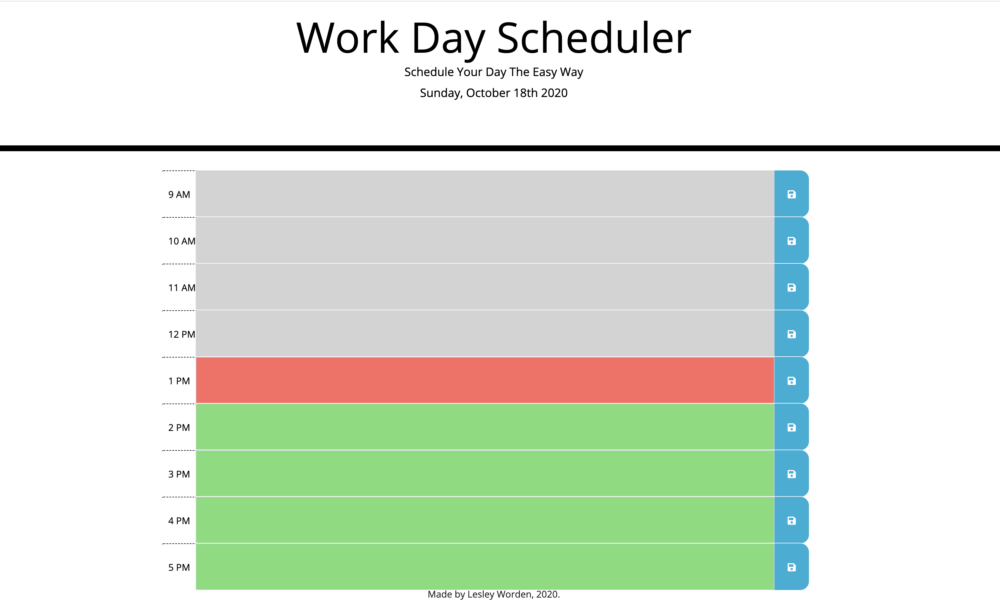

Homework -5 Work Day Scheduler

App displays the average workday of 9-5 with 1 hour blocked increments. 
The user may edit any hour of time they wish and then click the save button to save it to local storage.

Time is set to current time. The grey blocks indicate the past, red blocks are current time and the green blocks are the future.

